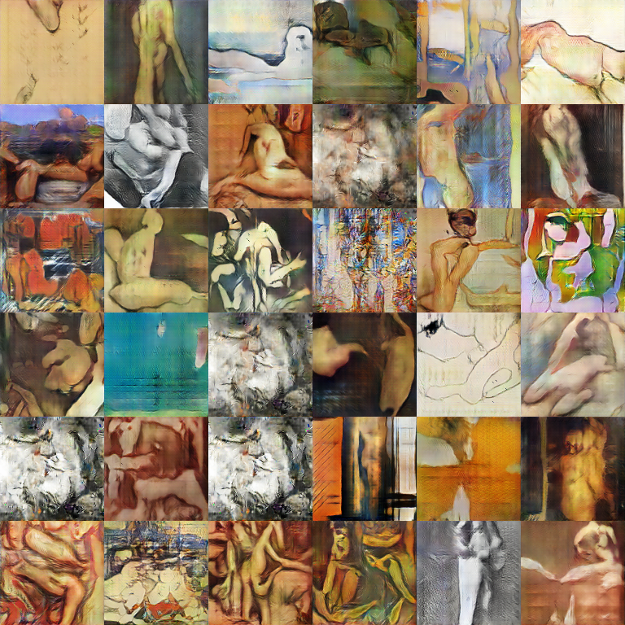

# GAN_art
repo for generative adversarial neural net for data art

also some side work on cellular automata generation

mostly notes/terminal logs for getting fukin GCP & docker up and running properly

final docker image for GPU with torch, CUDA, cudN etc saved at: andrewjuey/dcgan-data-art 

